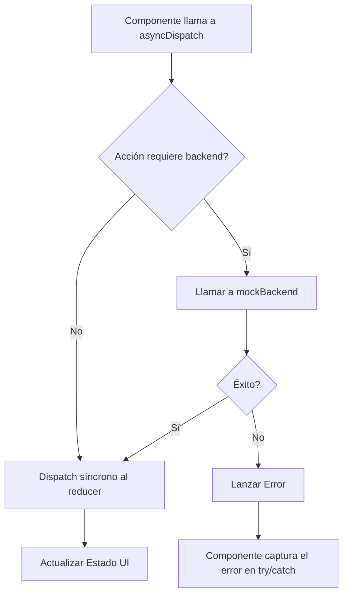

# Refactorización del Manejo de Estado Asíncrono

**Autor:** Kilo Code
**Fecha:** 27 de septiembre de 2025
**Estado:** Aprobado (v2)

---

## 1. Resumen Ejecutivo

Este documento detalla la refactorización del manejo de estado asíncrono y la gestión de errores en el sistema. El objetivo fue solucionar ineficiencias críticas, como escrituras innecesarias en el backend, y la falta de un mecanismo robusto para el manejo de errores de la API. La solución introduce un patrón de despacho de acciones asíncronas en `BusinessContext`, permitiendo a los componentes de UI interactuar de manera controlada, con validaciones y feedback explícito al usuario.

---

## 2. Análisis del Problema Original

La versión anterior de `BusinessContext.tsx` presentaba deficiencias significativas:

*   **`useEffect` de Persistencia Indiscriminada:** Un `useEffect` guardaba todo el estado en cada cambio, causando escrituras innecesarias y problemas de rendimiento.
*   **Elusión del `dispatch`:** Este `useEffect` eludía el sistema de `dispatch`, impidiendo un manejo de errores de API centralizado.
*   **`dispatch` Síncrono:** El `dispatch` original de `useReducer` era síncrono, inadecuado para gestionar operaciones de red que pueden fallar.

---

## 3. Solución Técnica

### 3.1. Arquitectura: `asyncDispatch`

Se introdujo un patrón de **despacho de acciones asíncronas** que envuelve el `dispatch` síncrono de `useReducer`.

**Diagrama de Flujo:**



### 3.2. Implementación

El `asyncDispatch` se convierte en la interfaz principal para operaciones de escritura. Los componentes ahora pueden `await` la finalización de una acción y reaccionar a su resultado.

**Ejemplo de Uso en un Componente:**

```typescript
// Ejemplo de cómo un componente usa el nuevo dispatch
const handleSave = async () => {
    try {
        // Se espera a que la operación asíncrona termine
        await dispatch({ 
            type: 'UPDATE_BUSINESS', 
            payload: updatedBusinessData 
        });
        // Éxito: mostrar notificación al usuario
        showSuccessToast('¡Guardado con éxito!');
    } catch (error) {
        // Error: el componente ahora es consciente del fallo
        setError(error.message);
    }
};
```

### 3.3. Validaciones

Se implementaron validaciones tanto en el frontend (`HoursEditor`) como en el backend (`mockBackend`) para garantizar la integridad de los datos.

**Ejemplo de Lógica de Validación en Frontend:**

```typescript
// La función de validación ahora devuelve un objeto más descriptivo
type ValidationResult = { isValid: boolean; error?: string };

const validateBusinessHours = (hours: Hours): ValidationResult => {
    for (const day of Object.keys(hours) as Array<keyof Hours>) {
        if (hours[day].enabled) {
            // Validar que no haya intervalos solapados
            if (!validarIntervalos(hours[day].intervals)) {
                return {
                    isValid: false,
                    error: `Los intervalos del ${day} se solapan`
                };
            }
            // Validar que los intervalos sean válidos (fin > inicio)
            for (const interval of hours[day].intervals) {
                if (interval.open >= interval.close) {
                    return {
                        isValid: false,
                        error: `Intervalo inválido en ${day}`
                    };
                }
            }
        }
    }
    return { isValid: true };
};
```

---

## 4. Pruebas y Calidad

La robustez de esta refactorización está garantizada por una suite de tests de integración en `services/api.integration.test.ts`.

**Ejemplo de Test de Integración Completo:**

```typescript
describe('Business Hours Update Integration', () => {
    it('should throw an error on overlapping intervals', async () => {
        // 1. Setup: Clonar datos de prueba
        const overlappingHoursData = clone(testBusinessData);
        
        // 2. Arrange: Crear datos inválidos
        overlappingHoursData.hours.tuesday.intervals = [
            { open: '09:00', close: '12:00' },
            { open: '11:00', close: '15:00' } // Solapamiento
        ];
        
        // 3. Act & Assert: Esperar que la llamada al backend falle
        await expect(
            mockBackend.updateBusinessData(overlappingHoursData)
        ).rejects.toThrow('Los intervalos de horario para el día tuesday se solapan.');
    });
});
```

---

## 5. Guía de Migración

Para adaptar componentes existentes al nuevo patrón:

1.  **Reemplazar `dispatch` síncrono:** Usa `asyncDispatch` para todas las operaciones que escriben datos.
2.  **Implementar `try/catch`:** Envuelve las llamadas a `asyncDispatch` para manejar errores de API.
    
    **Antes:**
    ```typescript
    const handleSave = () => {
        dispatch({ type: 'SET_HOURS', payload: newHours });
    };
    ```
    
    **Después:**
    ```typescript
    const handleSave = async () => {
        try {
            await dispatch({ 
                type: 'UPDATE_BUSINESS', 
                payload: { ...business, hours: newHours } 
            });
            showSuccessMessage('Horarios actualizados');
        } catch (error) {
            showErrorMessage(error.message);
        }
    };
    ```
3.  **Usar Estado Local para Borradores:** Para formularios complejos, introduce un estado local y llama a `asyncDispatch` solo al guardar.

---

## 6. Consideraciones de Rendimiento

*   **Reducción de Escrituras:** El cambio principal elimina escrituras innecesarias en el `localStorage` (nuestro backend simulado), mejorando el rendimiento al evitar operaciones costosas en cada cambio de estado.
*   **Memoización:** El uso de `useMemo` en `BusinessContext` sigue siendo crucial para prevenir re-renderizados innecesarios en componentes consumidores que no están afectados por un cambio de estado específico.

---

## 7. Monitoreo y Logging (Consideraciones Futuras)

Aunque no se implementó en esta fase, el nuevo patrón facilita la integración de un sistema de logging y monitoreo.

**Ejemplo de Manejo de Errores Específicos:**

```typescript
// utils/error-handler.ts (Ejemplo conceptual)
class ValidationError extends Error {}
class NetworkError extends Error {}

const handleApiError = (error: unknown): string => {
    if (error instanceof ValidationError) {
        // Log de error de validación con detalles
        console.warn('Validation Error:', error.message);
        return `Error de validación: ${error.message}`;
    }
    if (error instanceof NetworkError) {
        // Log de error de red
        console.error('Network Error:', error);
        return 'Error de conexión. Intente nuevamente.';
    }
    // Log de error genérico
    console.error('Unexpected Error:', error);
    return 'Error inesperado. Contacte soporte.';
};